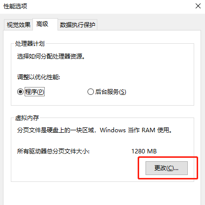
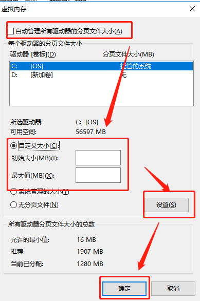

# 内存不足引起电脑卡顿的解决方案

## 1.禁用.NET缓存

在工具包内找到禁用.NET缓存的工具，双击运行即可

## 2.设置虚拟缓存

2.1 右键“我的电脑”，选择”属性“菜单，进入“系统属性”设置项，在高级内找到“性能”选项卡，点击设置

2.2 在性能选项卡中，点击“高级”，然后点击右下角的“更改”按钮

2.3  将“自动管理所有驱动器的分页文件大小”关闭，然后选择硬盘，在选择“自定义大小”，将初始大小的最大值设置为可用空间的五分之一，最小值为最大值的二分之一，然后点击设置，再点击确定，完成设置

## 3.设置客户端获取管理员权限

安装好客户端后，在客户端图标上右键，点击“属性”，在“兼容性”选项卡中勾选“以管理员身份运行此程序”后点击确定即可

